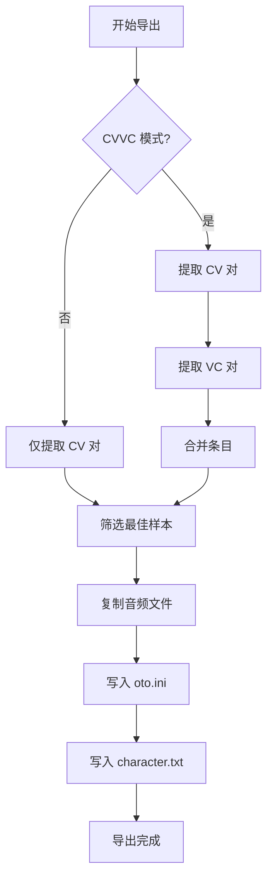
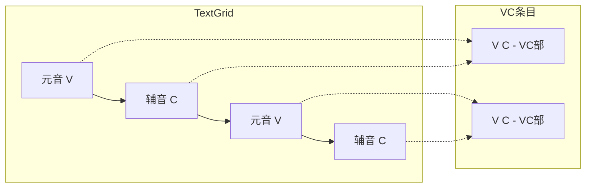

# CVVC 音源导出功能设计方案

## 1. 概述

本方案为 [`utau_oto_export.py`](src/export_plugins/utau_oto_export.py) 插件添加 CVVC（Consonant-Vowel-Vowel-Consonant）音源导出功能。CVVC 相比传统 CV 音源，额外生成 **VC 部（元音到辅音过渡）** 条目，使音源在连续演唱时过渡更加自然流畅。

## 2. CVVC 音源结构

### 2.1 条目类型

| 类型 | 别名格式 | 示例 | 说明 |
|------|----------|------|------|
| **CV** | `{辅音}{元音}` | `ba`, `ka`, `ni` | 辅音+元音（现有功能） |
| **V** | `- {元音}` | `- a`, `- i` | 句首元音（现有功能，纯元音） |
| **VC** | `{元音} {辅音}` | `a k`, `i n` | 元音到辅音过渡（**新增**） |
| **VV** | `{元音} {元音}` | `a i`, `i u` | 元音到元音过渡（可选，暂不实现） |

### 2.2 VC 部参数计算

VC 部捕捉从元音到下一个辅音的过渡，参数计算逻辑如下：

```
音频时间线: |----元音(V)----|----辅音(C)----|
                      ^              ^
                   VC开始         VC结束
                   (offset)       (cutoff位置)
```

**VC 部参数说明：**

| 参数 | 计算方式 | 说明 |
|------|----------|------|
| offset | `vowel_end - vowel_duration × vc_offset_ratio` | VC 开始位置，在元音后半段 |
| consonant | `min(30, (consonant_end - offset) × 0.3)` | 固定区域，较短 |
| cutoff | `-(consonant_end - offset)` | 负值，到辅音结束 |
| preutterance | `vowel_end - offset` | 从 offset 到辅音开始的距离 |
| overlap | `preutterance × overlap_ratio` | 与前一音符的交叉淡化 |

## 3. 代码修改设计

### 3.1 新增配置选项

在 [`get_options()`](src/export_plugins/utau_oto_export.py:254) 方法中添加以下选项：

```python
PluginOption(
    key="cvvc_mode",
    label="CVVC 模式",
    option_type=OptionType.SWITCH,
    default=False,
    description="启用 CVVC 模式，额外生成 VC 部（元音到辅音过渡）条目"
),
PluginOption(
    key="vc_alias_separator",
    label="VC 别名分隔符",
    option_type=OptionType.COMBO,
    default=" ",
    choices=[" ", "_", "-"],
    description="VC 部别名中元音和辅音之间的分隔符",
    visible_when={"cvvc_mode": True}
),
PluginOption(
    key="vc_offset_ratio",
    label="VC 偏移比例",
    option_type=OptionType.NUMBER,
    default=0.5,
    min_value=0.3,
    max_value=0.8,
    description="VC 部开始位置 = 元音结束位置 - 元音时长 × 此比例",
    visible_when={"cvvc_mode": True}
),
PluginOption(
    key="vc_overlap_ratio",
    label="VC Overlap 比例",
    option_type=OptionType.NUMBER,
    default=0.5,
    min_value=0.3,
    max_value=0.8,
    description="VC 部的 Overlap = Preutterance × 此比例",
    visible_when={"cvvc_mode": True}
),
```

### 3.2 新增方法

#### 3.2.1 `_extract_vc_pairs()` - 提取 VC 对

在 [`_extract_cv_pairs()`](src/export_plugins/utau_oto_export.py:534) 方法基础上，新增 VC 对提取逻辑：

```python
def _extract_vc_pairs(
    self,
    words_tier,
    phones_tier,
    wav_name: str,
    wav_duration_ms: float,
    language: str,
    use_hiragana: bool,
    vc_offset_ratio: float,
    vc_overlap_ratio: float,
    vc_separator: str
) -> List[Dict]:
    """
    从 phones 层提取元音+辅音对（VC 部）
    
    VC 部捕捉从当前元音到下一个辅音的过渡
    """
    entries = []
    intervals = list(phones_tier)
    
    for i, interval in enumerate(intervals):
        phone = interval.mark.strip()
        
        if phone in SKIP_MARKS:
            continue
        
        # 当前是元音，检查下一个是否是辅音
        if is_vowel(phone, language):
            vowel = phone
            vowel_start_ms = interval.minTime * 1000
            vowel_end_ms = interval.maxTime * 1000
            vowel_duration = vowel_end_ms - vowel_start_ms
            
            # 检查下一个音素
            if i + 1 < len(intervals):
                next_interval = intervals[i + 1]
                next_phone = next_interval.mark.strip()
                
                if next_phone not in SKIP_MARKS and is_consonant(next_phone, language):
                    consonant = next_phone
                    consonant_end_ms = next_interval.maxTime * 1000
                    
                    # 生成 VC 别名
                    v_alias = ipa_to_alias(None, vowel, language, use_hiragana)
                    c_alias = ipa_to_alias(consonant, None, language, use_hiragana)
                    
                    if v_alias and c_alias:
                        vc_alias = f"{v_alias}{vc_separator}{c_alias}"
                        
                        # 计算 VC 参数
                        entry = self._calculate_vc_params(
                            wav_name=wav_name,
                            alias=vc_alias,
                            vowel_start_ms=vowel_start_ms,
                            vowel_end_ms=vowel_end_ms,
                            consonant_end_ms=consonant_end_ms,
                            wav_duration_ms=wav_duration_ms,
                            vc_offset_ratio=vc_offset_ratio,
                            vc_overlap_ratio=vc_overlap_ratio
                        )
                        entries.append(entry)
    
    return entries
```

#### 3.2.2 `_calculate_vc_params()` - 计算 VC 参数

```python
def _calculate_vc_params(
    self,
    wav_name: str,
    alias: str,
    vowel_start_ms: float,
    vowel_end_ms: float,
    consonant_end_ms: float,
    wav_duration_ms: float,
    vc_offset_ratio: float,
    vc_overlap_ratio: float
) -> Dict:
    """
    计算 VC 部的 oto.ini 参数
    
    VC 部从元音后半段开始，到辅音结束
    """
    vowel_duration = vowel_end_ms - vowel_start_ms
    
    # offset: 元音后半段位置
    offset = vowel_end_ms - vowel_duration * vc_offset_ratio
    
    # 总时长
    segment_duration = consonant_end_ms - offset
    
    # preutterance: 从 offset 到辅音开始（即元音结束）的距离
    preutterance = vowel_end_ms - offset
    
    # consonant: 固定区域，较短
    consonant = min(30, segment_duration * 0.3)
    
    # overlap: 较大，平滑过渡
    overlap = preutterance * vc_overlap_ratio
    
    # cutoff: 负值，表示总时长
    cutoff = -segment_duration
    
    return {
        "wav_name": wav_name,
        "alias": alias,
        "offset": round(offset, 1),
        "consonant": round(consonant, 1),
        "cutoff": round(cutoff, 1),
        "preutterance": round(preutterance, 1),
        "overlap": round(overlap, 1),
        "segment_duration": segment_duration,
        "is_vc": True  # 标记为 VC 部
    }
```

### 3.3 修改 `_parse_textgrids()` 方法

在 [`_parse_textgrids()`](src/export_plugins/utau_oto_export.py:463) 中添加 CVVC 模式支持：

```python
def _parse_textgrids(
    self,
    slices_dir: str,
    textgrid_dir: str,
    language: str,
    use_hiragana: bool,
    overlap_ratio: float,
    cvvc_mode: bool = False,           # 新增
    vc_offset_ratio: float = 0.5,      # 新增
    vc_overlap_ratio: float = 0.5,     # 新增
    vc_separator: str = " "            # 新增
) -> Tuple[List[Dict], set]:
    # ... 现有代码 ...
    
    # 提取 CV 对（现有逻辑）
    entries = self._extract_cv_pairs(...)
    oto_entries.extend(entries)
    
    # 如果启用 CVVC 模式，额外提取 VC 对
    if cvvc_mode:
        vc_entries = self._extract_vc_pairs(
            words_tier, phones_tier, wav_name, wav_duration_ms,
            language, use_hiragana,
            vc_offset_ratio, vc_overlap_ratio, vc_separator
        )
        oto_entries.extend(vc_entries)
    
    # ... 现有代码 ...
```

### 3.4 修改 `export()` 方法

在 [`export()`](src/export_plugins/utau_oto_export.py:353) 中读取 CVVC 相关选项：

```python
def export(self, source_name: str, bank_dir: str, options: Dict[str, Any]) -> Tuple[bool, str]:
    # ... 现有选项读取 ...
    
    # CVVC 模式选项
    cvvc_mode = options.get("cvvc_mode", False)
    vc_separator = options.get("vc_alias_separator", " ")
    vc_offset_ratio = float(options.get("vc_offset_ratio", 0.5))
    vc_overlap_ratio = float(options.get("vc_overlap_ratio", 0.5))
    
    # 调用 _parse_textgrids 时传入新参数
    oto_entries, wav_files = self._parse_textgrids(
        paths["slices_dir"],
        paths["textgrid_dir"],
        language,
        use_hiragana,
        overlap_ratio,
        cvvc_mode=cvvc_mode,
        vc_offset_ratio=vc_offset_ratio,
        vc_overlap_ratio=vc_overlap_ratio,
        vc_separator=vc_separator
    )
    
    # ... 现有代码 ...
```

## 4. 流程图



## 5. VC 部提取流程



## 6. 实现步骤

1. **添加配置选项** - 在 [`get_options()`](src/export_plugins/utau_oto_export.py:254) 中添加 CVVC 相关选项
2. **实现 VC 参数计算** - 新增 `_calculate_vc_params()` 方法
3. **实现 VC 对提取** - 新增 `_extract_vc_pairs()` 方法
4. **修改解析逻辑** - 更新 [`_parse_textgrids()`](src/export_plugins/utau_oto_export.py:463) 支持 CVVC 模式
5. **修改导出入口** - 更新 [`export()`](src/export_plugins/utau_oto_export.py:353) 读取新选项
6. **更新版本号** - 将版本从 1.1.0 更新为 1.2.0

## 7. 预期输出示例

启用 CVVC 模式后，oto.ini 将包含：

```ini
# CV 部（现有）
test_0000.wav=ba,30,50,-110,50,15
test_0000.wav=ka,140,60,-140,60,18

# VC 部（新增）
test_0000.wav=a k,70,20,-90,40,20
test_0000.wav=a n,180,25,-100,45,22
```

## 8. 注意事项

1. **跨字边界**：VC 部可能跨越 words 层的边界，需要决定是否限制在同一个字内
2. **别名冲突**：VC 别名可能与 CV 别名冲突，需要确保分隔符正确
3. **质量筛选**：VC 部也需要参与质量评分和筛选
4. **编码兼容**：VC 别名中的分隔符需要兼容目标编码（如 Shift_JIS）
